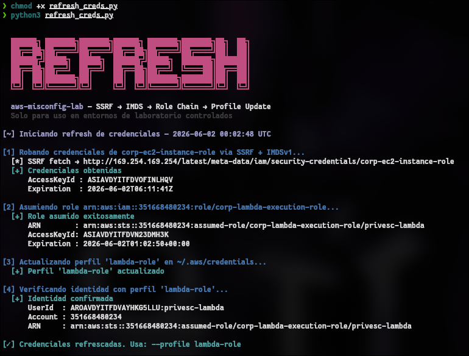
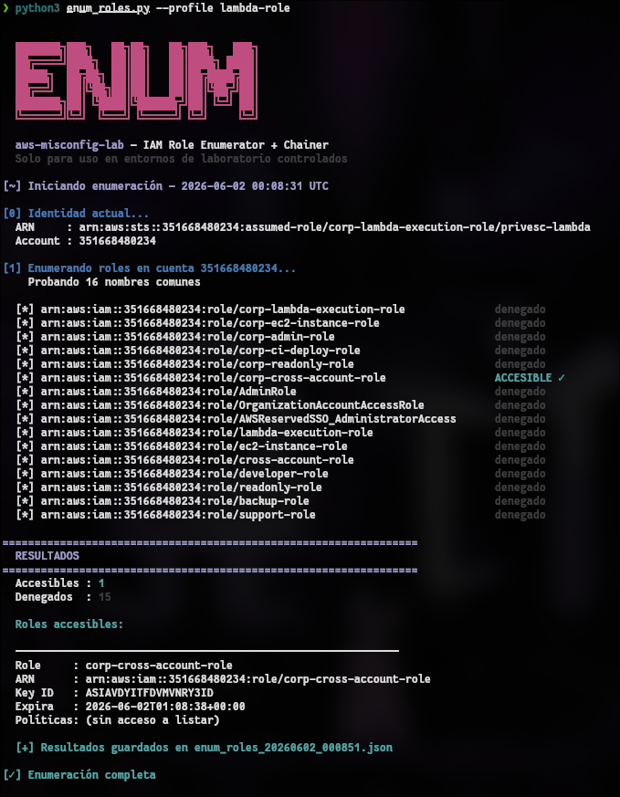
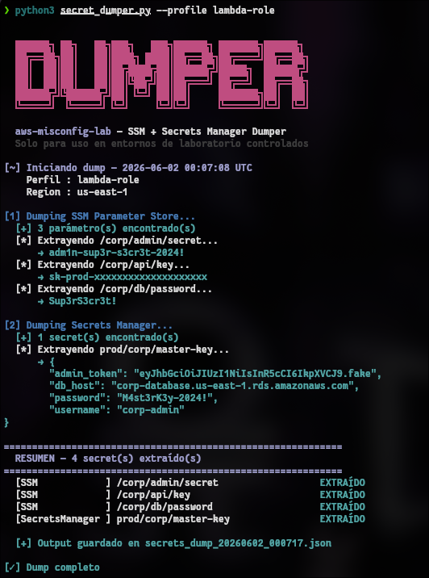

# aws-offensive-tools

Colección de scripts ofensivos para AWS desarrollados como parte del [aws-misconfig-lab](https://github.com/espinalclark/aws-misconfig-lab). Automatizan el abuse de misconfiguraciones comunes: SSRF → IMDS, IAM Role enumeration y secrets dumping.

> ⚠️ Solo para uso en entornos autorizados.

---

## Tools

### `refresh_creds.py` — SSRF → IMDSv1 → Role Chain



Automatiza la cadena completa: explota un endpoint SSRF vulnerable para robar credenciales del EC2 role via IMDSv1, asume el siguiente role en la cadena y actualiza el perfil local de AWS CLI.

```bash
python3 refresh_creds.py
python3 refresh_creds.py --ssrf-url http://<TARGET>:8080/fetch --role <ROLE_ARN>
```

---

### `enum_roles.py` — IAM Role Enumerator



Itera sobre nombres comunes de roles IAM e intenta asumirlos desde el perfil actual. Detecta roles accesibles, lista sus políticas y guarda los resultados en JSON.

```bash
python3 enum_roles.py --profile lambda-role
python3 enum_roles.py --profile lambda-role --account <ACCOUNT_ID>
```

---

### `secret_dumper.py` — SSM + Secrets Manager Dumper



Extrae todos los secrets de SSM Parameter Store y Secrets Manager usando el perfil comprometido. Guarda output en JSON con timestamp.

```bash
python3 secret_dumper.py --profile lambda-role
python3 secret_dumper.py --profile lambda-role --output dump.json
```

---

## Attack Chain

```
SSRF → IMDSv1 credential theft → assume-role (EC2 → Lambda)
→ IAM role enumeration → cross-account access
→ SSM/Secrets Manager dump
```

---

## Requirements

```bash
pip install boto3
# AWS CLI v2 instalado y configurado
```

---

## Author

**Clark Espinal** — [@cl4rksec](https://github.com/espinalclark)  
Junior Pentester | eJPT | ICCA
